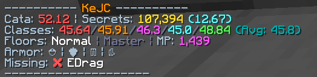

<h1 align="center">Dungeon Stats Display (Minescript)</h1>

  A Minecraft Hypixel Skyblock Dungeon script.
   
  You can use your own API key to see user stats.
   
  Base on Minescript

 

 
   
   

## Why this?
- Recently, the Odin mod has occasionally been displaying error codes related to 429 or 500, which often prevents us from quickly determining whether a user’s gear, secrets, and other items meet our requirements.
- So, I created this script—which is **less than a thousand** lines long—to allow users to **send requests by applying for your own API keys**.
- Also, all data returned from Hypixel is processed locally; **your API key will not be uploaded anywhere other than Hypixel!**

## Demo
I based this on Odin's output format — **shout-out to Odin!**

## How to use?
- [Download Minescript](https://modrinth.com/mod/minescript) from Modrinth
- **Download** the `dungeon_stats_display.py` file.
- Put `dungeon_stats_display.py` file to the minscript foldor. (which might be in `.minecraft/minescript` depends on what client you are using)
- **DON'T forget to generate your API key at [Hypixel developer](https://developer.hypixel.net/dashboard)**.
- After enter your Minecraft, type `\dungeon_stats_display` in chat. (which start this script)
- Type `!dsd key YOUR_API_KEY` (replace YOUR_API_KEY with your autual key)
  - You can also type `!dsd key` to see if your key is set correctly.
- You can now join any party finder! You will see the stats of the player who join!

## TODO
- The hover function is not working right now, so you can not autually see what armor are user wearing.

## License
[Apache-2.0](LICENSE)